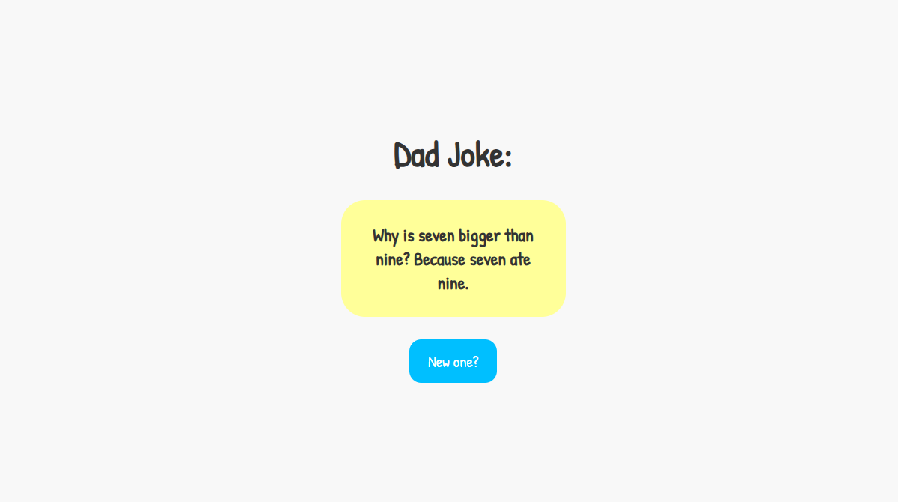

# 🚀 Dad Joke App

(Live on: https://dad-joke-app-ka.netlify.app/)
A quick app that fetches new dad jokes using an API. Built in HTML, CSS, and JS.



---

## 🌟 Table of Contents

* [About the Project](#about-the-project)
* [Built With](#built-with)
* [Getting Started](#getting-started)
* [Prerequisites](#prerequisites)
* [Installation](#installation)
* [Fixes and Updates](#fixes-and-updates-section)
* [License](#license-section)

---

## ✨ About The Project

I built this Dad Joke App using HTML, CSS, and JS. I mastered **asynchronous operations** using **`fetch()`** and **`async/await`** without freezing the browser. I added **`try...catch`** error handling and used **`.style.visibility`** with the **`isLoading`** flag to manage the button state while fetching. I've learned a lot doing this little fun project. This was my very first time using fetch and async/await in JS.

### 🛠️ Built With

The project was entirely built using **vanilla HTML, CSS, and JS**.

---

## ⚙️ Getting Started

### Prerequisites

You need a modern web-browser and internet access.

### Installation

1.  **Clone the repository:**

    ```
    git clone "https://github.com/khalilanaspriv/dad-joke-app"
    ```

2.  **Navigate into the project directory:**

    ```
    cd dad-joke-app
    ```

3.  **Open `index.html` in your browser.**

---

<a name="fixes-and-updates-section"></a>
## 🗺️ Fixes and Updates

* [ ] **New Feature:** Implement a **"Save Joke"** button that uses the **`localStorage` API** to store favorite jokes across sessions.
* [ ] **New Feature:** Add support for **joke categories** (e.g., General, Programming, etc.) using a dropdown menu or buttons, requiring modifications to the `fetch` URL.
* [ ] **UI Polish:** Enhance the overall **User Interface (UI)** and visual design to be more polished and modern.

-----

<a name="license-section"></a>
## ⚖️ License

Distributed under the **MIT License** License. See `LICENSE.txt` for more information.

-----
